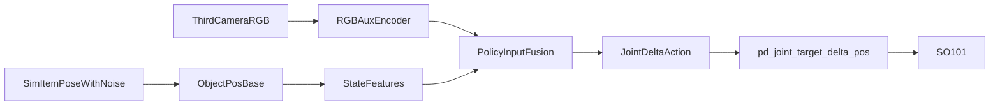

# SO101 Lift位置中间层最小可行计划

## 目标与范围
- 目标：在不影响现有训练/部署代码的前提下，新增一套可并行运行的 `Lift-Position` 流程。
- 约束：
  - 不直接改原逻辑；采用“复制后新文件”方式。
  - 第一阶段任务仅 `lift + single cube`。
  - 策略动作沿用当前 `pd_joint_target_delta_pos`（关节增量）。
  - 位置来源先用仿真真值+噪声（验证流程），RGB仅作为辅助输入。
  - 相机辅助通道先用第三人称相机。

## 代码复制与新入口（不破坏现有）
- 复制训练脚本为新入口（例如 `train_squint_pos.py`），基于 [train_squint.py](/home/linyu/squint/train_squint.py) 最小改动。
- 复制部署脚本为新入口（例如 `deploy_pos.py`），基于 [deploy.py](/home/linyu/squint/deploy.py) 最小改动。
- 新增环境文件（例如 `envs/lift_position.py`），从 [envs/lift.py](/home/linyu/squint/envs/lift.py) 继承并裁剪到 `cube-only`。
- 在 [envs/__init__.py](/home/linyu/squint/envs/__init__.py) 增加新环境注册导入，保留原环境不变。

## 环境层改造（位置中间层）
- 在新环境中保留原 `Lift` 的场景构建、成功条件、奖励和域随机化逻辑（来自 [envs/lift.py](/home/linyu/squint/envs/lift.py) 与 [envs/base_random_env.py](/home/linyu/squint/envs/base_random_env.py)）。
- 新增位置观测字段（基座系）：
  - `object_pos_base`（核心）
  - `tcp_to_object_pos`（可直接用于控制）
  - `position_valid`（检测/估计失败标志位，当前阶段应恒为1）
- 第一阶段位置来源：使用仿真 `item.pose.p` 真值并注入噪声（高斯+裁剪）模拟检测误差；噪声参数化，便于后续对齐真实检测质量。

## 训练侧改造（位置为主，RGB为辅）
- 在新训练脚本中保留现有算法框架（Actor/Critic、ReplayBuffer、并行env数、优化流程），仅调整观测拼接：
  - 将 `object_pos_base` 与 `tcp_to_object_pos` 合并入 `state` 分支输入。
  - 保留第三人称 `rgb` 的 CNN 编码分支，作为辅助上下文。
- 保持当前控制模式与动作维度不变，避免同时改动作空间和观测空间导致定位问题困难。
- 评估指标先对齐现有：`success`、`return/reward`、`success_once/success_at_end`（沿用 [train_squint.py](/home/linyu/squint/train_squint.py) 统计口径）。

## 部署侧改造（为真实检测预留接口）
- 在新部署脚本中，保留 [deploy.py](/home/linyu/squint/deploy.py) 的 Sim2Real 结构与安全控制逻辑。
- 新增 `position_provider` 抽象接口：
  - `SimGTPositionProvider`：当前阶段默认（使用仿真/同步位姿）
  - `RealDetectorPositionProvider`：仅留接口与占位实现（下阶段接RGB-D检测）
- 失败重试策略：当 `position_valid==0`（后续真实检测阶段）时执行短暂重采样与保持/小动作探索，不直接下发危险动作。

## 验证与里程碑
- 里程碑1：新环境可创建、可reset、可step，观测中包含位置字段且维度稳定。
- 里程碑2：新训练入口可跑通并收敛到与原`lift cube`同量级成功率。
- 里程碑3：新部署入口可运行，策略可执行闭爪并抬起动作（成功判据沿用原任务）。
- 里程碑4：记录“仅位置+少量RGB辅助”与“原始视觉主导”对比结果，为下一阶段真实检测改造提供基线。

## 第二阶段预埋（不在本次实施）
- 将 `SimGTPositionProvider` 切换为真实 `RGB-D` 检测实现（颜色/深度阈值或轻量检测器）。
- 逐步扩大到多物体与更多日用品，必要时再引入抓取朝向与分层策略。

## 数据流（第一阶段）

